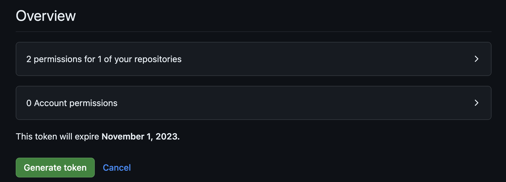

# 03 - Create and configure Managed Config Server for Spring

__This guide is part of the [Build, Run and Monitor Intelligent Spring Java Apps on Azure Container Apps and Azure OpenAI](../README.md)__

Another key feature of cloud-native applications is *externalized configuration* - the ability to store, manage, and version configuration separately from the application code. In this section, we'll create and configure a [Spring Cloud Config Server](https://spring.io/projects/spring-cloud-config) to enable this functionality. In the next section, you'll see how Spring Cloud Config can inject configuration from a Git repository into your application.

---

> ⏱ If you want to skip the step of creating a private repository, you can use this public repository instead: [https://github.com/Azure-Samples/java-on-aca-sample-public-config.git](https://github.com/Azure-Samples/java-on-aca-sample-public-config.git). __Storing configuration in a public repository is not recommended in real-world deployments.__ We offer this public repository only as a shortcut for this workshop, for example if you don't have a GitHub account.
>
> To use this shortcut:
>  1. Define the following environment variables.
>     ```bash
>     CONFIG_SERVER_NAME="configserver01"
>     GIT_URL="https://github.com/Azure-Samples/java-on-aca-sample-public-config.git"
>     ```
>  2. Create the Managed Config Server for Spring and set its configuration source as the public Git repository.
>     ```bash
>     az containerapp env java-component config-server-for-spring create \
>         --environment $ENVIRONMENT \
>         --resource-group $RESOURCE_GROUP \
>         --name $CONFIG_SERVER_NAME \
>         --configuration spring.cloud.config.server.git.uri=$GIT_URL
>     ```
>  
>  We have enabled Azure Container Apps to create a Managed Config Server for Spring, with the configuration files from the public repository. You can now proceed to the next guide: 
>  ➡ [04 - Build a Spring Boot microservice using Spring Cloud features](../04-build-a-spring-boot-microservice-using-spring-cloud-features/README.md)

## Create a Git repository for storing the application configuration

On your [GitHub account](https://github.com), create a new **private** repository where the Spring Boot configurations will be stored.

In the new private GitHub repository, add a new `application.yml` file which will store configuration data for all our microservices.

Typically, each Spring Boot application includes such a file within the application's deployable artifact to contain application settings. A Spring Cloud Config Server allows such settings to be stored at a single location and served from a single source.

For the moment, our `application.yml` will just store a message to check if the configuration is successful:

```yaml
application:
    message: Configured by Managed Config Server for Spring. Configuration in private repository.
```

Commit and push the new file.

## Create a GitHub personal token

Managed Config Server for Spring can access Git repositories that are public, secured by SSH, or secured using HTTP basic authentication. We will use that last option, as it is easier to create and manage with GitHub.

Let's create a new token by going into the [GitHub developer settings](https://github.com/settings/apps) and selecting "Personal access tokens" and "Fine-grained tokens" in the menu. Give it a name such as `java-on-aca-training`.


We select the private config repository, we've just created.


And then we specify the Repository permissions.


Only the `Contents` `Read-only` permission is required.


After that is done, click on "Generate token" and copy the token value.



Once the token is generated, leave that tab open until the end of this section.

If you need more help here, please follow the [GitHub guide to create a personal token documentation.](https://help.github.com/en/articles/creating-a-personal-access-token-for-the-command-line)

## Create and configure a Managed Config Server to access the Git repository

Define the environment variables. Please note that those environment variables defined in [01 - Build a simple Java application](../01-build-a-simple-java-application/README.md) will also be used.

```bash
CONFIG_SERVER_NAME="configserver01"
GIT_URL="Change to your Git repository URL: https://github.com/{repository}.git"
GIT_USERNAME="Change to your Github login name"
GIT_PAT="Change to the personal access token we created in the previous section"
```

Create the Managed Config Server and set its configuration source as your Git repository.

```bash
az containerapp env java-component config-server-for-spring create \
    --environment $ENVIRONMENT \
    --resource-group $RESOURCE_GROUP \
    --name $CONFIG_SERVER_NAME \
    --configuration spring.cloud.config.server.git.uri=$GIT_URL \
        spring.cloud.config.server.git.username=$GIT_USERNAME \
        spring.cloud.config.server.git.password=$GIT_PAT
```

## Review

We have now created a private configuration repository. We have enabled Azure Container Apps to create a Managed Config Server for Spring with the configuration files from this repository.

In the next section, we will create an application that consumes this configuration, specifically the custom message we defined in `application.yml`.

---

⬅️ Previous guide: [02 - Create Managed Eureka Server for Spring](../02-create-managed-eureka-server-for-spring/README.md)

➡️ Next guide: [04 - Build a Spring Boot microservice using Spring Cloud features](../04-build-a-spring-boot-microservice-using-spring-cloud-features/README.md)
